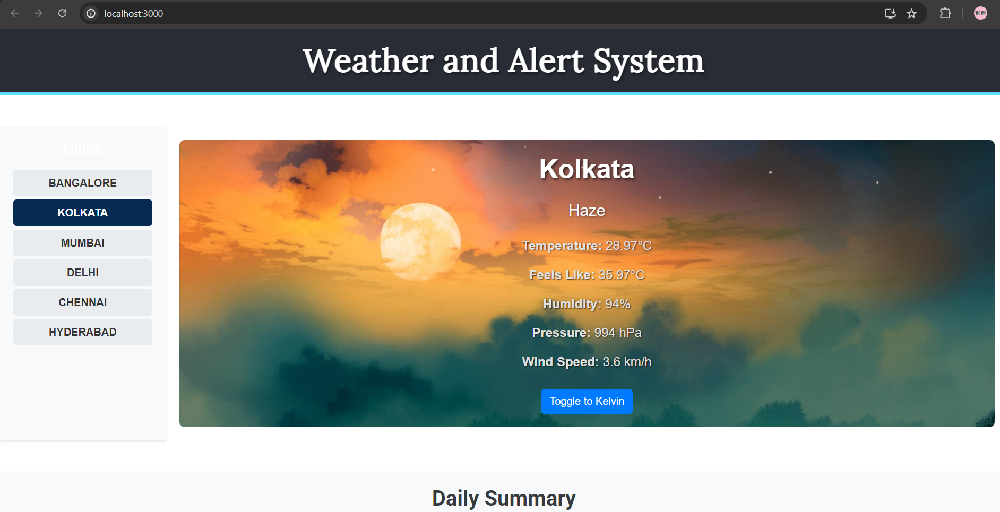
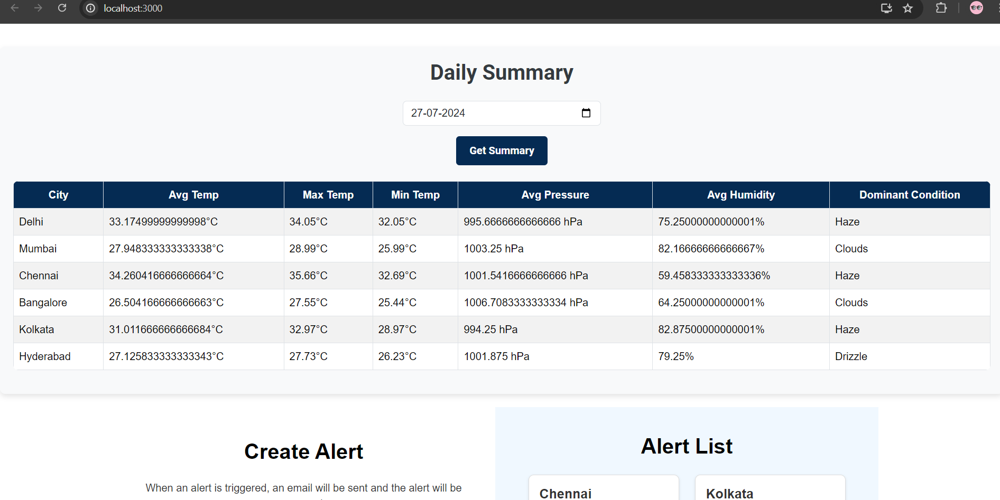
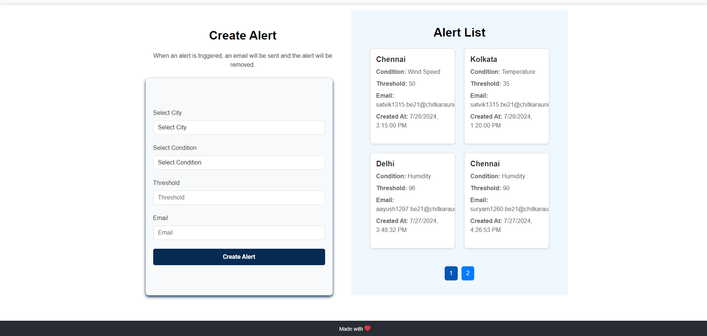

# Real-Time Data Processing System for Weather Monitoring

## Project Description

This project involves developing a real-time data processing system for weather monitoring. The system retrieves weather data from the OpenWeatherMap API, processes it to provide summarized insights using rollups and aggregates, and sends alerts based on user-configured thresholds.

### Features

- **Real-Time Data Fetching**: The server fetches weather data from the OpenWeatherMap API at configurable intervals.
- **Data Storage and Processing**: Store the weather data, process it to compute aggregate values, and store daily summaries.
- **Temperature Conversion**: Convert temperature values between Celsius and Kelvin based on user preference.
- **Daily Weather Summary**: Calculate and store daily aggregates including average, maximum, minimum temperature, and dominant weather condition.
- **Alerting Thresholds**: Define thresholds for temperature or specific weather conditions. Send email alerts using Nodemailer when thresholds are triggered.

### Tech Stack

- **MongoDB**: For data storage.
- **Express.js**: For backend server framework.
- **React.js**: For frontend user interface.
- **Node.js**: For backend runtime environment.
- **Nodemailer**: For sending email notifications.
- **Bootstrap**: For styling the frontend.

### Installation

#### Backend

1. Clone the repository:
    ```bash
    git clone <repository-url>
    ```
2. Navigate to the backend directory:
    ```bash
    cd backend
    ```
3. Install dependencies:
    ```bash
    npm install
    ```
4. Start the server:
    ```bash
    node index.js
    ```
   The server will start at port 3001.

#### Frontend

1. Navigate to the frontend directory:
    ```bash
    cd weather-app
    ```
2. Install dependencies:
    ```bash
    npm install
    ```
3. Start the React application:
    ```bash
    npm start
    ```
   The application will run on port 3000.

### Images




